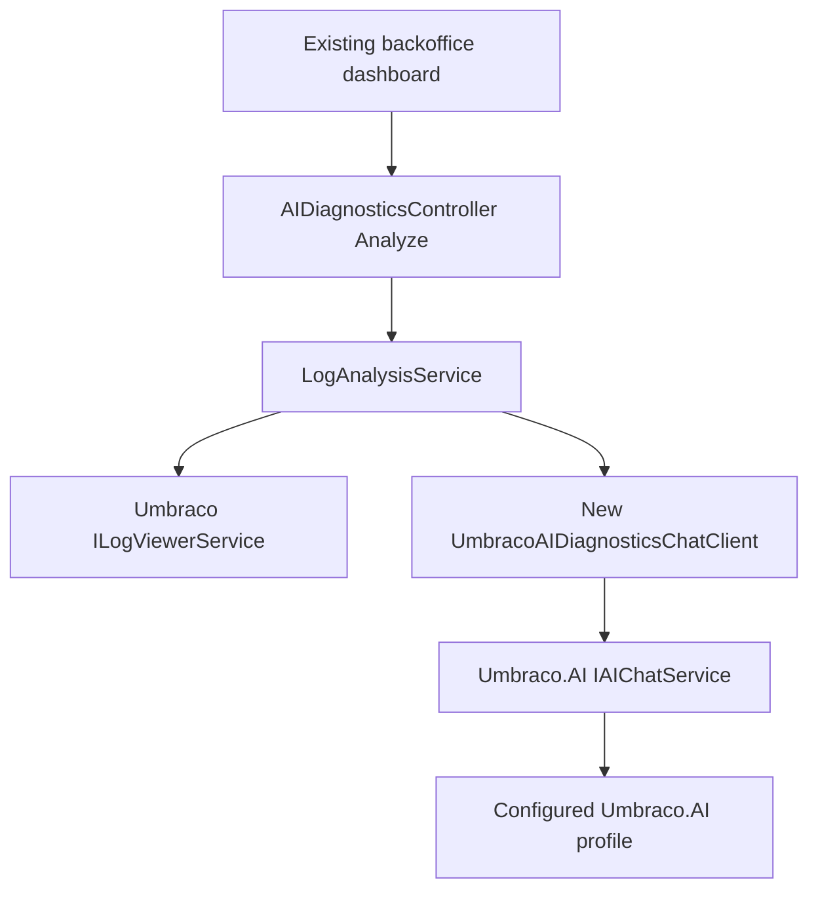

# Umbraco.AI Refactor Plan

## Goal
Keep the backoffice unchanged and replace the custom AI layer with Umbraco.AI. The stable frontend contract remains `POST /umbraco/backoffice/umbracoaidiagnostics/api/aidiagnostics/analyze`, `AnalysisRequest`, and `AnalysisReport`.

## Main Backend Changes
- In [`Umbraco.AI.Diagnostics/Umbraco.AI.Diagnostics.csproj`](Umbraco.AI.Diagnostics/Umbraco.AI.Diagnostics.csproj), add the official Umbraco.AI dependency used for `IAIChatService`. Do not add provider packages to the reusable package unless the official package requires it at compile time; host sites should install/configure providers.
- Replace the current local `IAIClient` implementations under [`Umbraco.AI.Diagnostics/AI`](Umbraco.AI.Diagnostics/AI) with a single Umbraco.AI-backed adapter, likely `UmbracoAIDiagnosticsChatClient`, that injects `Umbraco.AI.Core.Chat.IAIChatService` and sends `Microsoft.Extensions.AI.ChatMessage` requests.
- Keep [`PromptLoader`](Umbraco.AI.Diagnostics/AI/PromptLoader.cs) or rename it to a diagnostics prompt service. It should still load `prompt/analysis-prompt.txt`, substitute `{LOG_DATA}`, and enforce the existing JSON schema expected by `ParseAIResponse`.
- Update [`LogAnalysisService`](Umbraco.AI.Diagnostics/Services/LogAnalysisService.cs) to depend on the new adapter instead of custom provider clients. Its log retrieval, batching, deduplication, `AnalysisReport` creation, and response parsing should remain behaviorally compatible.
- Configure Umbraco.AI calls with a required alias such as `umbraco-ai-diagnostics-log-analysis`, and optionally a profile alias from diagnostics options. Use `WithAlias(...)`, `WithProfile(...)` when configured, and `WithChatOptions(...)` for deterministic JSON-focused output.
- Improve AI response handling while preserving the public response: extract JSON text from `ChatResponse.Message.Text`, tolerate fenced JSON if a provider returns it, and fall back to raw log items if parsing fails.

## Configuration Migration
- Simplify [`DiagnosticsOptions`](Umbraco.AI.Diagnostics/Models/DiagnosticsOptions.cs) to keep diagnostics-owned settings only: `LogLevels`, `MaxBatchSize`, `EnableAI`, `PromptFilePath`, and a new optional `UmbracoAIProfileAlias` or similar.
- Remove provider-owned settings from diagnostics config: `AIProvider`, `Ollama`, `Gemini`, `OpenAI`, and `AzureOpenAI`.
- Update [`ServiceCollectionExtensions`](Umbraco.AI.Diagnostics/Extensions/ServiceCollectionExtensions.cs) so it registers only diagnostics services and the new Umbraco.AI adapter. Remove all `AddHttpClient<GeminiClient/OpenAIClient/AzureOpenAIClient/OllamaClient>()` registrations and provider selection logic.
- Keep `EnableAI = false` behavior: when disabled, no Umbraco.AI call is made and the existing raw grouped log report is returned.

## Test Site And Docs
- Update [`Umbraco.AI.Diagnostics.Web/Umbraco.AI.Diagnostics.Web.csproj`](Umbraco.AI.Diagnostics.Web/Umbraco.AI.Diagnostics.Web.csproj) to include `Umbraco.AI` plus at least one provider package for local verification, following the official guidance that Umbraco.AI needs a configured provider.
- Update [`Umbraco.AI.Diagnostics.Web/appsettings.json`](Umbraco.AI.Diagnostics.Web/appsettings.json) to remove old provider credentials from `AI:Diagnostics`; use Umbraco.AI connection/profile setup instead, with secrets referenced through Umbraco.AI configuration/backoffice where appropriate.
- Update [`README.md`](README.md) and [`Umbraco.AI.Diagnostics/README.md`](Umbraco.AI.Diagnostics/README.md) to document the breaking migration: install/configure Umbraco.AI, create or select a chat profile, optionally set `AI:Diagnostics:UmbracoAIProfileAlias`, then use the existing Settings dashboard.
- Leave [`buildTransitive/Umbraco.AI.Diagnostics.targets`](Umbraco.AI.Diagnostics/buildTransitive/Umbraco.AI.Diagnostics.targets), static backoffice assets, manifests, and routes untouched unless build output proves they need adjustment.

## Verification
- Build the package project with `dotnet build Umbraco.AI.Diagnostics/Umbraco.AI.Diagnostics.csproj`.
- Build the frontend only if backend changes unexpectedly affect packaging, otherwise avoid unnecessary backoffice churn.
- Run the test site after configuring an Umbraco.AI profile and manually verify the existing dashboard still returns `totalLogsAnalyzed`, `uniqueLogsCount`, `aiSummary`, and `logAnalysisItems`.
- If time allows during implementation, add focused unit tests around the adapter/parser boundary: AI disabled, malformed AI JSON fallback, valid AI JSON mapping, and profile alias configuration.